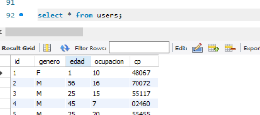
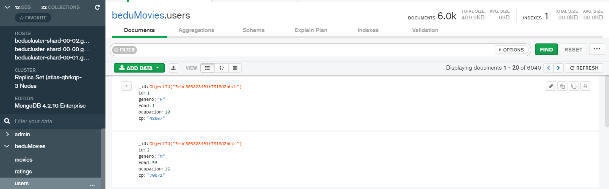

Durante el reto creamos las tablas de los 3 datasets

```sql
create table if not exists users(
	id int primary key ,
    genero char(1),
    edad int,
    ocupacion varchar(100),
    cp varchar(20)
);
```

```sql
create table movies(
	id int primary key auto_increment,
    titulo varchar(100),
    categoria varchar(100)
);

```

```sql
create table ratings(
	id int primary key auto_increment,
    user_id INT, 
	movie_id INT, 
	rating INT, 
	tiempo BIGINT
);
```




Relizamos la importacion del dataset en MongoDB



